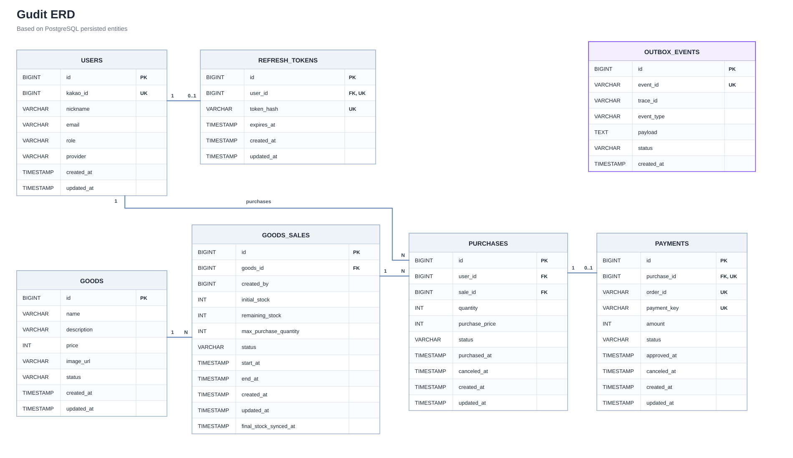

# Gudit

> **한정 수량 굿즈의 안정적인 선착순 구매와 결제를 위한 타임세일 서비스**

---

## 프로젝트 소개

한정 판매 서비스에서는 판매 시작과 동시에 다수의 구매 요청이 집중될 수 있다.

이 과정에서 다음과 같은 문제를 고려했다.

* 여러 사용자가 동시에 같은 재고를 변경하면서 발생할 수 있는 초과 판매
* 연속 클릭이나 요청 재전송으로 인한 중복 구매
* Redis 재고 차감 이후 DB 저장 실패로 인한 상태 불일치
* 외부 결제 시스템과 내부 구매·결제 상태 간 정합성 문제
* 결제 승인, 구매 취소, Timeout이 동시에 발생하는 상황의 동시성 문제

이를 해결하기 위해 Redis 기반 재고 처리와 Toss Payments 결제를 중심으로 구매 흐름을 구성하고, 동시성 및 부하 테스트를 통해 주요 정책을 검증했다.

---

## 개발 기간

### 기능 구현
**2026.08.07 ~ 2026.08.25**

### Kotlin 전환
**2026.09.11 ~ 2026.09.18**

---

## 팀원 및 역할

| 팀원 | 역할 |
| --- | --- |
| 신창석 | 팀장 / 인증·인가 / 공통 예외 처리 / Swagger / k6 테스트 / 테스트 자동화 / CI/CD |
| 박예은 | 구매 / 결제 / Frontend / 결제 동시성 테스트 / 발표 자료 |
| 정진협 | 상품 / 판매 / 재고 / 재고 동시성 테스트 / 모니터링 · 로깅 / 알림센터 / 발표 |

---

## 주요 기능

### 사용자

* Kakao OAuth2 로그인
* JWT 기반 인증·인가
* 판매 중인 굿즈 조회
* 선착순 상품 구매
* Toss Payments 결제
* 구매 내역 조회
* 구매 및 결제 취소
* 미결제 구매 Timeout 처리

### 관리자

* 상품 등록 및 관리
* 판매 등록 및 관리
* 판매 기간 및 초기 재고 설정
* 1인 최대 구매 수량 설정
* 판매 상태 관리

### 재고 및 동시성

* Redis 기반 실시간 재고 관리
* Lua Script를 이용한 재고 차감 및 구매 제한 원자 처리
* 판매 시작 전 Redis Warm-up
* 판매 종료 후 Redis 재고를 RDB에 동기화
* 구매·결제 상태 변경 시 비관적 락 적용

---

## 기술 스택

### Backend

* Java 25 -> Kotlin
* Spring Boot 4.1.0
* Spring MVC
* Spring Data JPA
* Spring Security
* OAuth2 Client
* Thymeleaf

### Database / Cache

* PostgreSQL
* Redis
* Redis Lua Script

### Authentication

* Kakao OAuth2
* JWT

### Payment

* Toss Payments

### Test

* JUnit
* k6

### Infrastructure

* Docker
* Docker Compose

### API Documentation

* Swagger / Springdoc OpenAPI

---

## 시스템 구성도

일반 사용자와 관리자는 Spring Boot 애플리케이션을 통해 서비스에 접근한다.

상품·판매·구매·결제 데이터는 PostgreSQL에 저장하고, 판매 중 실시간 재고와 사용자별 구매 수량은 Redis에서 관리한다.

외부 서비스로는 인증에 Kakao OAuth2, 결제에 Toss Payments를 연동했다.

---

## ERD

---

## 핵심 구현

### Redis + Lua Script 기반 선착순 재고 처리

판매 시작 시 다수의 요청이 하나의 재고에 집중되는 상황을 고려해 Redis를 실시간 재고 처리에 사용했다.

구매 요청 시 Lua Script 내부에서 다음 조건을 확인한다.

1. 판매 정보 존재 여부
2. 판매 상태
3. 판매 기간
4. 사용자별 최대 구매 수량
5. 현재 재고

모든 조건을 만족한 경우 재고 차감과 사용자별 구매 수량 증가를 하나의 Lua Script에서 원자적으로 처리한다.

조건을 만족하지 못한 요청은 DB에 접근하기 전에 Redis 단계에서 실패 처리한다.

---

### Redis-RDB 정합성 보상 처리

Redis에서 재고를 먼저 차감한 뒤 구매 및 결제 정보를 RDB에 저장한다.

Redis 차감 이후 DB 트랜잭션이 실패하면 재고만 감소한 상태가 남을 수 있으므로,   
DB 트랜잭션 결과에 따라 Redis 재고와 사용자별 구매 수량을 복구하는 보상 처리를 적용했다.

---

### Toss Payments 결제 정합성

외부 결제 시스템과 내부 DB는 하나의 트랜잭션으로 처리할 수 없기 때문에 결제 결과에 따라 상태를 보정하도록 구성했다.

* 주문번호 기반 멱등성 키를 통한 중복 승인 방지
* 결제 결과가 불확실한 경우 Toss 결제 상태 재조회
* Toss 승인 이후 내부 처리 실패 시 결제 보상 취소
* Toss Webhook을 통한 최종 결제 상태 보정

---

### 결제·취소·Timeout 동시성 제어

동일한 구매에 대해 결제 승인, 사용자 취소, Timeout 처리가 동시에 실행될 수 있다.

이를 방지하기 위해 구매와 결제 처리 과정에 비관적 락을 적용하고,   
락 획득 이후 현재 상태를 다시 검증한 뒤 실제 처리 가능한 요청만 상태를 변경하도록 구성했다.

---

## 동시성 및 성능 테스트

k6를 활용해 동시 요청 상황에서 재고·구매·결제의 정합성을 검증하고,
부하 테스트를 통해 병목 지점을 확인했다.

### 동시성 테스트

| 시나리오 | 실행 조건 | 결과 |
| --- | --- | --- |
| 재고 초과 구매 | 재고 100 / 1,000 VU | 성공 100건 / 정상 거절 900건 / 초과 판매 0건 |
| 단일 판매 집중 | 재고 1,000 / 1,000 VU | 1,000건 성공 / 최종 재고 0 |
| 분산 판매 | 판매 100개 / 1,000 VU | 모든 판매 재고 0 |
| 중복 구매 | 동일 사용자 / 50 VU | 성공 1건 / 정상 거절 49건 |
| 구매 취소 | 동일 구매 / 50 VU | 취소 1회 / 재고 1회 복구 |
| 결제 승인 | 동일 결제 / 50 VU | 승인 1회 / 최종 상태 일치 |
| 승인·취소 경쟁 | 승인 1 VU + 취소 1 VU | DB·Redis 최종 상태 일치 |

개선 전·후 각각 3회씩 총 42개 시나리오를 실행했으며,
모든 업무 검증을 통과했다.

- 예상 밖 업무 응답: **0건**
- Connection Refused: **0건**
- `status=0` / Timeout: **0건**
- 초과 판매·중복 처리·상태 불일치: **0건**

### 주요 성능 개선

부하 테스트 과정에서 판매 목록 조회 시 `Sale.goods`의 LAZY 로딩으로 인해
판매 106개 조회에 총 107회의 SQL이 실행되는 N+1 문제를 확인했다.

`@EntityGraph(attributePaths = "goods")`를 적용해 Sale과 Goods를 함께 조회하도록 개선했다.

| 지표 | 개선 전 | 개선 후 | 변화 |
| --- | ---: | ---: | ---: |
| 판매 목록 SQL | 107회 | 1회 | N+1 제거 |
| Baseline 목록 p95 | 64.45ms | 34.34ms | **46.7% 감소** |
| Stress 목록 p95 | 3.49초 | 2.77초 | **20.8% 감소** |
| Stress Dropped | 4,413 | 1,418 | **67.9% 감소** |
| App 평균 CPU | 143.00% | 90.67% | **36.6% 감소** |
| DB 평균 CPU | 70.63% | 8.20% | **88.4% 감소** |

### 남은 한계

- Stress 목록 p95가 목표 2초를 초과한 **2.77초**
- Spike 목록 p95가 목표 3초를 초과한 **3.37초**
- Stress·Spike 구간에서 `dropped_iterations`가 남아 있어 500 RPS 안정 처리는 확인하지 못함
- 판매 목록 전체 조회와 판매별 Redis 재고 개별 조회가 이후 병목 후보로 남음

> 3차 프로젝트에서는 운영 환경과 성능 테스트 환경을 개선하고 안정 처리량을 추가로 검증할 예정이다.

---

## 3차 프로젝트 결과

2차 프로젝트에서 구현한 선착순 구매·결제 구조를 유지하면서, 장애 복구와 운영 가시성, 코드 안정성 및 개발 자동화를 보완했다.

* **Kotlin 점진 전환**
  * 사용자, 인증, 공통, 상품, 판매, 재고, 구매, 결제, CS, Outbox와 화면 영역의 운영 코드 및 관련 테스트를 Kotlin으로 전환
  * 운영·테스트 소스 207개 중 202개를 Kotlin으로 구성하고, 성능 계측용 Java 파일과 애플리케이션 컨텍스트 테스트 5개만 유지
  * nullable 타입, data class, 기본 인자와 표현식 함수를 적용해 null 처리와 DTO·서비스 코드를 명확하게 개선
* **장애 복구 구조 강화**
  * 재고 복구와 결제 보상 요청을 DB 트랜잭션과 함께 저장하는 Transactional Outbox Pattern 적용
  * Redis Streams Consumer Group을 이용해 이벤트를 처리하고, 미처리 Pending 이벤트를 재시도하도록 구성
  * 이벤트 식별자를 Redis Streams 메시지에 포함하고 처리 성공·실패와 재시도 상태를 추적
* **모니터링 및 알림 구축**
  * Spring Actuator와 Micrometer를 통해 HTTP, 재고, Outbox 및 Redis Streams 지표 수집
  * Prometheus, Grafana, Loki, Alloy를 이용해 메트릭과 로그를 한 화면에서 확인하도록 구성
  * Trace ID 기반 요청 추적과 Grafana 장애 감지 규칙, Slack 알림 적용
* **AI 고객 문의 자동화**
  * n8n Webhook으로 고객 문의를 수신하고 내부 API에서 주문·결제 상태를 조회하는 워크플로우 구현
  * AI 분석 결과와 실패 상황을 Slack으로 전달하고 내부 API Key로 서비스 간 호출 보호
* **개발 품질 자동화**
  * GitHub Actions에서 JDK 25, Redis 서비스 컨테이너를 사용해 PR마다 전체 테스트 자동 실행
  * 실패 여부와 관계없이 테스트 보고서를 업로드해 원인 확인이 가능하도록 구성
  * n8n 기반 AI 코드 리뷰와 CI 실패 요약을 통해 PR 피드백 과정을 자동화
  * 실제 SecurityConfig와 일치하도록 Swagger 인증·인가 문서를 최신화
* **성능 및 정합성 검증 보강**
  * Kotlin 전환 이후에도 재고 초과 판매, 중복 구매, 승인·취소 경합과 보상 처리 시나리오를 재검증
  * 판매 목록 N+1 개선 효과를 Baseline·Stress 환경에서 반복 측정하고 테스트 데이터·실행 절차를 정비

---

## 한계 및 이후 개선 방향

3차 프로젝트를 통해 장애 복구와 관측 가능성, 테스트 자동화 기반을 마련했지만 실제 운영 환경에서 장기간 검증해야 할 부분이 남아 있다.

### 남은 한계

* 성능 계측용 코드와 기본 컨텍스트 테스트 등 Java 파일 5개가 남아 있어 전체 Kotlin 전환은 완료되지 않음
* Stress 목록 조회 p95가 2.77초, Spike p95가 3.37초로 목표 시간을 초과했으며 500 RPS 안정 처리도 확인하지 못함
* Outbox와 Redis Streams가 최종 일관성을 보완하지만 Redis 장애, 장기 Pending 이벤트와 반복 실패 이벤트에 대한 별도 DLQ 및 운영자 재처리 기능이 부족함
* Redis·RDB·Toss Payments 사이의 원자적 트랜잭션은 여전히 불가능하므로 보상 처리와 주기적인 데이터 대조가 필요함
* 모니터링과 알림은 로컬 Docker Compose 환경을 중심으로 검증했으며, 실제 배포 환경의 장기 지표와 적정 경보 임계값이 충분하지 않음
* PR CI는 테스트 실행에 집중되어 있어 코드 스타일, 정적 분석, 테스트 커버리지 기준, 보안 검사와 자동 배포 단계가 포함되지 않음
* n8n 워크플로우는 실행 서버와 Webhook 주소, 외부 AI 및 Slack 연결 상태에 영향을 받으며 AI 리뷰의 오탐을 최종적으로 사람이 확인해야 함

### 이후 개선 방향

* 남은 Java 코드를 Kotlin으로 전환하고 ktlint·detekt를 CI에 추가해 코드 스타일과 잠재 오류를 자동 검증
* 판매 목록 페이지네이션, 조회 캐시와 Redis 재고 일괄 조회를 적용해 Stress·Spike 구간의 응답 시간과 누락 요청 개선
* Outbox 재처리 관리 API, DLQ, Inbox 또는 멱등 처리 기록과 Redis·RDB 정합성 점검 작업을 추가해 복구 절차 자동화
* Testcontainers와 장애 주입 테스트를 도입해 Redis 중단, DB 실패, 외부 결제 Timeout과 재시작 이후 복구 과정 검증
* 실제 배포 환경에서 Prometheus·Grafana 장기 지표를 수집하고 SLO에 기반한 경보 임계값과 운영 대시보드 조정
* n8n에 고정 Webhook 주소, 상태 점검, 요청 서명, 재시도·중복 방지와 실행 이력 보관을 적용해 운영 안정성 강화
* 테스트 커버리지 기준, 의존성·보안 검사와 배포 승인 단계를 포함하는 CI/CD 파이프라인으로 확장

---

## Branch Convention

* `main`: 최종 배포 및 완료 버전
* `dev`: 개발 통합 브랜치
* `feat/*`: 기능 개발
* `fix/*`: 버그 수정 및 기능 개선
* `test/*`: 테스트 및 성능 검증
