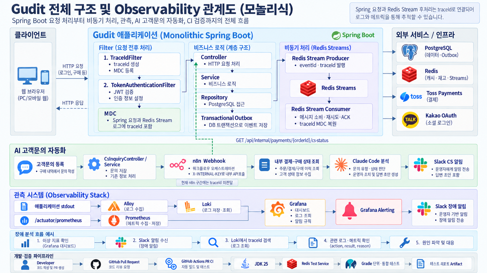
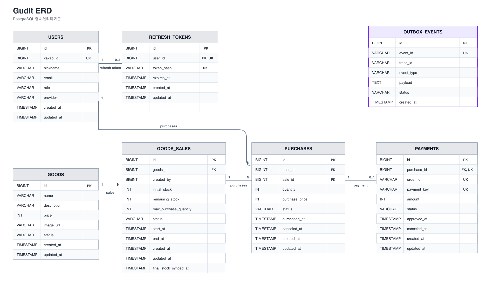

# Gudit

> **한정 수량 굿즈의 안정적인 선착순 구매와 결제를 위한 타임세일 서비스**

---

## 프로젝트 소개

한정 판매 서비스에서는 판매 시작과 동시에 다수의 구매 요청이 집중될 수 있다.

이 과정에서 다음과 같은 문제를 고려했다.

* 여러 사용자가 동시에 같은 재고를 변경하면서 발생할 수 있는 초과 판매
* 연속 클릭이나 요청 재전송으로 인한 중복 구매
* Redis 재고 차감 이후 DB 저장 실패로 인한 상태 불일치
* 외부 결제 시스템과 내부 구매·결제 상태 간 정합성 문제
* 결제 승인, 구매 취소, Timeout이 동시에 발생하는 상황의 동시성 문제
* DB 상태 변경 이후 Redis 재고 복구에 실패하는 문제
* 외부 결제 보상 취소 실패 시 재처리 수단이 부족한 문제

2차 프로젝트에서는 Redis 기반 재고 처리와 Toss Payments 결제를 중심으로 구매 흐름을 구성하고,   
동시성 및 부하 테스트를 통해 주요 정책을 검증했다.

3차 프로젝트에서는 기존 구조를 유지하면서 Transactional Outbox와 Redis Streams를 도입해   
재고 복구 및 결제 보상 실패 시 재처리할 수 있도록 개선했다.   
또한 Kotlin 전환과 모니터링·개발 자동화를 통해 코드 유지보수성과 운영 환경을 개선했다.

---

## 개발 기간

### 2차 프로젝트
**2026.08.07 ~ 2026.08.25**

### 3차 프로젝트
**2026.09.11 ~ 2026.09.18**

---

## 팀원 및 역할

| 팀원 | 역할                                                                       |
| --- |--------------------------------------------------------------------------|
| 신창석 | 팀장 / 인증·인가 / 공통 예외 처리 / Swagger / k6 테스트 / 테스트 자동화 / CI/CD               |
| 박예은 | 구매 / 결제 / Outbox · Redis Streams / AI CS / Frontend / 결제 동시성 테스트 / 발표 자료 |
| 정진협 | 상품 / 판매 / 재고 / 재고 동시성 테스트 / 모니터링 · 로깅 / 알림센터 / 발표                        |

---

## 주요 기능

### 사용자

* Kakao OAuth2 로그인
* JWT 기반 인증·인가
* 판매 중인 굿즈 조회
* 선착순 상품 구매
* Toss Payments 결제
* 구매 내역 조회
* 구매 및 결제 취소
* 미결제 구매 Timeout 처리
* 주문 관련 고객 문의 등록

### 관리자

* 상품 등록 및 관리
* 판매 등록 및 관리
* 판매 기간 및 초기 재고 설정
* 1인 최대 구매 수량 설정
* 판매 상태 관리
* Slack을 통한 AI 고객 문의 분석 결과 및 답변 초안 검토

### 재고 및 동시성

* Redis 기반 실시간 재고 관리
* Lua Script를 이용한 재고 차감 및 구매 제한 원자 처리
* 판매 시작 전 Redis Warm-up
* 판매 종료 후 Redis 재고를 RDB에 동기화
* 구매·결제 상태 변경 시 비관적 락 적용

### 장애 복구 및 정합성

* Transactional Outbox 기반 재고 복구 및 결제 보상 요청 기록
* Redis Streams 기반 비동기 이벤트 처리 및 실패 재처리
* Lua Script를 이용한 재고 중복 복구 방지
* Toss 멱등 키와 결제 상태 재조회를 통한 중복 보상 방지

### 모니터링 및 운영 자동화

* Prometheus·Grafana 기반 주요 지표 모니터링
* Alloy·Loki 기반 로그 수집 및 traceId 추적
* 장애 발생 및 복구 시 Slack 알림
* n8n·AI 기반 고객 문의 분석 및 답변 초안 생성

### 개발 자동화

* GitHub Actions 기반 PR 빌드 및 테스트 자동화
* n8n 기반 AI 코드 리뷰 및 CI 실패 분석
* 규칙 기반 분석 후 필요 시 AI 호출
* GitHub PR 댓글 및 Slack을 통한 분석 결과 전달

---

## 기술 스택

### Backend

* JDK 25
* Java → Kotlin 전환
* Spring Boot 4.1.0
* Spring MVC
* Spring Data JPA
* Spring Security
* OAuth2 Client
* Thymeleaf

### Database / Cache

* PostgreSQL
* Redis
* Redis Lua Script

### Messaging / Reliability

* Redis Streams
* Transactional Outbox Pattern

### Authentication

* Kakao OAuth2
* JWT

### Payment

* Toss Payments

### Test

* JUnit
* Mockito
* k6

### Monitoring / Logging

* Spring Boot Actuator / Micrometer
* Prometheus / Grafana
* Alloy / Loki

### Automation / AI

* GitHub Actions
* n8n
* Claude
* Slack

### Infrastructure

* Docker
* Docker Compose

### API Documentation

* Swagger / Springdoc OpenAPI

---

## 시스템 구성도

일반 사용자와 관리자는 Spring Boot 애플리케이션을 통해 서비스에 접근한다.

상품·판매·구매·결제 데이터는 PostgreSQL에 저장하고, 판매 중 실시간 재고와 사용자별 구매 수량은 Redis에서 관리한다.

재고 복구 및 결제 보상 요청은 PostgreSQL의 Outbox에 기록하고, Redis Streams를 통해 비동기로 전달하여 실패 시 재처리한다.

외부 서비스로는 인증에 Kakao OAuth2, 결제에 Toss Payments를 연동했다.

Prometheus·Grafana와 Alloy·Loki를 활용해 메트릭과 로그를 관찰하고, 장애 발생 시 Slack 알림을 전송한다.

또한 GitHub Actions와 n8n 기반 워크플로우를 통해 CI 검증, AI 코드 리뷰, CI 실패 분석 및 고객 문의 분석을 자동화했다.

---

## ERD

---

## 핵심 구현

### Redis + Lua Script 기반 선착순 재고 처리

판매 시작 시 다수의 요청이 하나의 재고에 집중되는 상황을 고려해 Redis를 실시간 재고 처리에 사용했다.

구매 요청 시 Lua Script 내부에서 다음 조건을 확인한다.

1. 판매 정보 존재 여부
2. 판매 상태
3. 판매 기간
4. 사용자별 최대 구매 수량
5. 현재 재고

모든 조건을 만족한 경우 재고 차감과 사용자별 구매 수량 증가를 하나의 Lua Script에서 원자적으로 처리한다.

조건을 만족하지 못한 요청은 DB에 접근하기 전에 Redis 단계에서 실패 처리한다.

---

### Redis-RDB 정합성 보상 처리

Redis에서 재고를 먼저 차감한 뒤 구매 및 결제 정보를 RDB에 저장한다.

Redis 차감 이후 DB 트랜잭션이 실패하면 재고만 감소한 상태가 남을 수 있으므로,   
DB 트랜잭션 결과에 따라 Redis 재고와 사용자별 구매 수량을 복구하는 동기 보상 처리를 적용했다.

---

### Transactional Outbox + Redis Streams 기반 재고 복구

구매 취소·결제 실패·Timeout 발생 시 DB 상태 변경과 재고 복구 요청을 동일한 트랜잭션에서 Outbox에 저장하도록 개선했다.

Publisher는 Outbox 이벤트를 Redis Streams에 발행하고, Consumer가 Redis 재고와 사용자별 구매 수량을 복구한다.

* 발행 실패 시 Outbox의 `PENDING` 상태를 유지해 재발행
* Consumer 처리 실패 시 ACK하지 않고 Pending 메시지를 재처리
* `eventId` 기반 Lua Script로 중복 재고 복구 방지

이를 통해 DB 상태 변경 이후 Redis 복구에 실패하더라도 복구 요청을 잃지 않고 재처리할 수 있도록 구성했다.

---

### Toss Payments 결제 정합성

외부 결제 시스템과 내부 DB는 하나의 트랜잭션으로 처리할 수 없기 때문에 결제 결과에 따라 상태를 보정하도록 구성했다.

* 주문번호 기반 멱등성 키를 통한 중복 승인 방지
* 결제 결과가 불확실한 경우 Toss 결제 상태 재조회
* Toss 승인 이후 내부 처리 실패 시 결제 보상 취소
* Toss Webhook을 통한 최종 결제 상태 보정

---

### Transactional Outbox 기반 결제 보상 재처리

Toss 승인 이후 내부 처리에 실패하면 즉시 결제 보상 취소를 시도한다.

보상 취소까지 실패한 경우 `PAYMENT_COMPENSATION_REQUIRED` 이벤트를 별도 트랜잭션에서 Outbox에 저장하고,   
Redis Streams를 통해 재처리하도록 개선했다.

Consumer는 Toss의 실제 결제 상태를 조회한 뒤 필요한 보상 작업을 수행한다.

* `DONE`: 결제 취소 재시도 및 내부 상태 보정
* `CANCELED`: 외부 취소를 재호출하지 않고 내부 상태 보정
* 동일한 Idempotency-Key와 내부 상태 검증을 통한 중복 보상 방지

외부 Toss API와 내부 DB의 원자성을 보장할 수 없으므로, 각 처리 단계의 멱등성을 확보했다.

---

### 결제·취소·Timeout 동시성 제어

동일한 구매에 대해 결제 승인, 사용자 취소, Timeout 처리가 동시에 실행될 수 있다.

이 과정에서 충돌하는 상태 변경을 방지하기 위해 구매와 결제 처리 과정에 비관적 락을 적용하고,   
락 획득 이후 현재 상태를 다시 검증한 뒤 실제 처리 가능한 요청만 상태를 변경하도록 구성했다.

---

## 동시성 및 성능 테스트

k6를 활용해 동시 요청 상황에서 재고·구매·결제의 정합성을 검증하고, 부하 테스트를 통해 병목 지점을 확인했다.

### 동시성 테스트

| 시나리오     | 실행 조건               | 결과                              |
| -------- | ------------------- | ------------------------------- |
| 재고 초과 구매 | 재고 100 / 1,000 VU   | 성공 100건 / 정상 거절 900건 / 초과 판매 0건 |
| 단일 판매 집중 | 재고 1,000 / 1,000 VU | 1,000건 성공 / 최종 재고 0             |
| 분산 판매    | 판매 100개 / 1,000 VU  | 모든 판매 재고 0                      |
| 중복 구매    | 동일 사용자 / 50 VU      | 성공 1건 / 정상 거절 49건               |
| 구매 취소    | 동일 구매 / 50 VU       | 취소 1회 / 재고 1회 복구                |
| 결제 승인    | 동일 결제 / 50 VU       | 승인 1회 / 최종 상태 일치                |
| 승인·취소 경쟁 | 승인 1 VU + 취소 1 VU   | DB·Redis 최종 상태 일치               |

Java와 Kotlin 환경에서 7개 시나리오를 각각 3회씩 총 42회 실행했으며, 검증한 시나리오에서 모든 업무 검증을 통과했다.

* 예상 밖 업무 응답: **0건**
* Connection Refused: **0건**
* `status=0` / Timeout: **0건**
* 검증한 시나리오의 초과 판매·중복 처리·상태 불일치: **0건**

### Kotlin 전환 회귀 검증

Java에서 Kotlin으로 전환한 이후 기존 비즈니스 동작이 유지되는지 확인했다.

* 최종 통합 테스트: **283건 전체 통과**
* 구매·결제 상태 전이 및 기존 비즈니스 로직 검증

동시성 테스트에서도 예상 성공·거절 건수와 Redis·RDB 최종 상태가 일치해,   
검증한 범위에서 Kotlin 전환으로 인한 기능·정합성 회귀는 발견되지 않았다.

---

### 주요 성능 개선 — 2차 프로젝트

부하 테스트 과정에서 판매 목록 조회 시 `Sale.goods`의 LAZY 로딩으로 인해 판매 106개 조회에 총 107회의 SQL이 실행되는 N+1 문제를 확인했다.

`@EntityGraph(attributePaths = "goods")`를 적용해 Sale과 Goods를 함께 조회하도록 개선했다.

| 지표              |    개선 전 |    개선 후 |           변화 |
| --------------- | ------: | ------: | -----------: |
| 판매 목록 SQL       |    107회 |      1회 |       N+1 제거 |
| Baseline 목록 p95 | 64.45ms | 34.34ms | **46.7% 감소** |
| Stress 목록 p95   |   3.49초 |   2.77초 | **20.8% 감소** |
| Stress Dropped  |   4,413 |   1,418 | **67.9% 감소** |
| App 평균 CPU      | 143.00% |  90.67% | **36.6% 감소** |
| DB 평균 CPU       |  70.63% |   8.20% | **88.4% 감소** |

위 수치는 2차 프로젝트에서 동일한 조건으로 측정한 개선 전후 결과이며, Kotlin 전환에 따른 성능 개선 수치는 아니다.

### 3차 성능 검증 결과 및 남은 한계

Java와 Kotlin 환경에서 동시성 테스트 7개 시나리오를 각각 3회 실행하고,   
Baseline·Stress·Spike·Mixed Purchase 부하 테스트와 30분 소크 테스트를 수행했다.

동시성 정합성은 모든 시나리오에서 유지됐으며, Baseline과 Mixed Purchase도 두 환경 모두 3회 통과했다.

다만 최대 500 RPS의 Stress·Spike 테스트에서는 요청 누락과 응답시간 편차가 발생해 안정 처리량을 보장하지 못했다.

Kotlin 소크 테스트에서는 30분간 약 100 RPS를 유지하고 HTTP 오류 없이 179,954건을 처리했으나,   
예정된 요청 46건(0.026%)을 실행하지 못해 `dropped_iterations == 0` 기준을 충족하지 못했다.

일부 시나리오에서 Kotlin의 응답시간이 증가하고, 소크 테스트에서 VU 사용량이 증가했지만,    
동일한 로컬 환경에서 애플리케이션과 k6를 함께 실행했으므로 언어 전환 자체가 원인이라고 단정할 수 없다.

향후 독립된 테스트 환경에서 JVM·GC·CPU·DB Connection Pool 등을 함께 관측해 고부하 구간의 병목 원인을 분석할 필요가 있다.

---

## 2차 프로젝트 결과

* Redis와 Lua Script를 활용해 재고 차감과 사용자별 구매 제한을 원자적으로 처리
* Redis 재고 선차감 이후 DB 트랜잭션 실패에 대한 동기 보상 처리 구현
* Toss Payments 승인·취소 및 Webhook 기반 결제 상태 보정 구현
* 결제 승인·구매 취소·Timeout 경합에 대한 비관적 락 기반 동시성 제어
* 판매 목록 N+1 문제를 개선해 SQL 호출을 107회에서 1회로 줄이고, 응답시간과 CPU 사용량 개선 확인
* k6 기반 동시성 및 부하 테스트 환경 구축

---

## 3차 프로젝트 결과

* Transactional Outbox와 Redis Streams를 도입해 재고 복구 및 결제 보상 요청을 기록하고, 발행·처리 실패 시 재처리하는 구조 구현
* 이벤트 재전달에 대비한 재고 복구 및 결제 보상 멱등 처리 적용
* Spring Actuator·Micrometer·Prometheus·Grafana·Loki·Alloy 기반 모니터링 및 traceId 로그 추적 환경 구축
* GitHub Actions에서 JDK 25·Redis 환경으로 PR 테스트를 자동 실행하고, 성공·실패와 관계없이 테스트 보고서 보관
* n8n 기반 AI 코드 리뷰 및 CI 실패 분석 자동화와 Swagger 인증·인가 문서 최신화
* n8n·AI 기반 고객 문의 분석 및 Slack 답변 초안 전달 기능 구현, 내부 주문·결제 조회 API에 API Key 인증 적용
* Production 파일의 98.1%(155/158개)를 Kotlin으로 전환하고 운영 코드 12.6% 감소
* 통합 테스트 283건 통과 및 동시성 테스트 7개 시나리오의 Java·Kotlin 정합성 검증 완료
* 부하·소크 테스트를 통해 Kotlin 전환 전후 성능을 비교하고 고부하 구간의 남은 한계 확인

---

## 한계 및 이후 개선 방향

3차 프로젝트에서는 Transactional Outbox와 Redis Streams를 활용해 재고 복구 및 결제 보상 요청을 기록하고,   
실패한 작업을 재처리할 수 있도록 개선했다.

다만 단계별 장애 대응을 검증한 것과 실제 운영 환경에서 전체 복구 과정을 검증하는 것은 별개이므로, 다음과 같은 개선 과제가 남아 있다.

* 실제 장애 발생부터 최종 Redis·DB 정합성 복구까지 검증하는 자동화 E2E 테스트 보강
* 최대 구매 수량이 2 이상인 상황의 중복 Purchase 생성에 대한 동시성 검증 및 DB 제약 검토
* 반복 실패 메시지의 최대 재시도 횟수와 DLQ 정책 마련
* PostgreSQL 환경에서 네이티브 쿼리 및 트랜잭션 동작 검증
* 실제 배포 환경에서 장기 지표를 수집하고 서비스 특성에 맞는 모니터링 알림 임계값 조정
* 고부하 구간의 병목 원인 분석 및 안정 처리량 확보
* CI에 정적 분석·테스트 커버리지 기준·보안 검사를 추가해 검증 범위 확장
* n8n 워크플로우의 장애 대응 및 실행 이력 관리 보강

---

## Branch Convention

* `main`: 최종 배포 및 완료 버전
* `dev`: 개발 통합 브랜치
* `feat/*`: 기능 개발
* `fix/*`: 버그 수정 및 기능 개선
* `test/*`: 테스트 및 성능 검증
