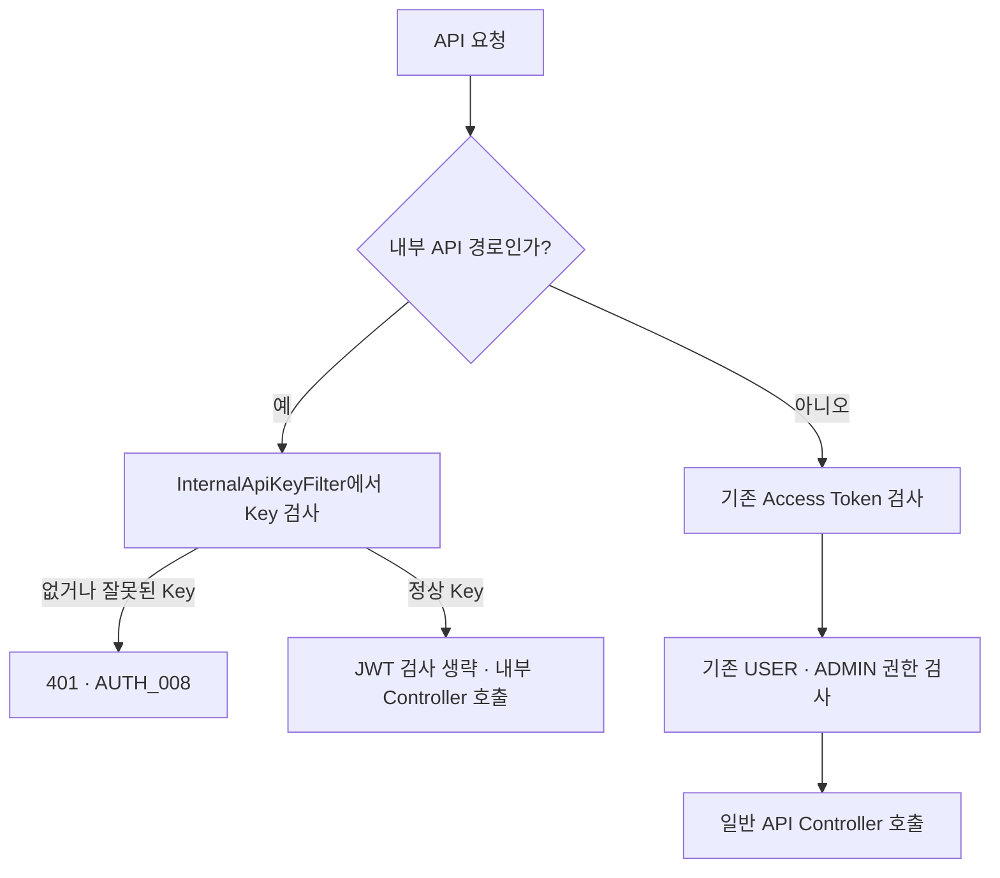

# PR #9 인증 코드 충돌 해결

작업일: 2026-09-16 · 대상 PR: [#9](https://github.com/prgrms-be-devcourse/NBE11-13-3-Team03/pull/9)

## 원인

두 작업이 같은 인증 코드를 서로 다른 방식으로 바꿨다.

- `kotlin/auth`는 기존 Java 인증 코드를 Kotlin으로 옮기면서 Java 파일을 삭제했다.
- 그 사이 `dev`에 병합된 PR #7은 내부 자동화 API를 위해 그 Java 인증 파일을 수정했다.

Git은 Java 파일 삭제와 수정을 어느 쪽으로 반영할지 결정할 수 없어 **modify/delete 충돌**을 표시했다. 같은 코드 줄을 수정한 단순 문법 충돌이 아니라 파일 이동과 기능 추가가 겹친 충돌이다.

| 충돌한 Java 파일 | dev에서 추가된 동작 | 반영한 Kotlin 파일 |
|---|---|---|
| `auth/SecurityConfig.java` | 내부 API 경로의 별도 인증과 InternalApiKeyFilter 연결 | `auth/SecurityConfig.kt` |
| `auth/exception/AuthErrorCode.java` | 잘못된 내부 Key의 `AUTH_008` 오류 | `auth/exception/AuthErrorCode.kt` |
| `auth/filter/TokenAuthenticationFilter.java` | 내부 API 요청의 JWT 검사 제외 | `auth/filter/TokenAuthenticationFilter.kt` |

## 해결 순서

1. 운영 자동화의 기존 저장소를 바꾸지 않고 별도 복제본에서 `kotlin/auth`를 체크아웃했다.
2. PR 원본 `ab5835ba8ab5060b218fd63cab4784f8a1066380`과 `dev`의 `43a94acc865d09e997275e6b87c4192e07c720f5`를 기준으로 `dev`를 병합했다.
3. 공통 조상과 dev의 차이를 읽어 내부 인증에서 새로 추가된 동작을 확인했다.
4. Java 파일을 되살리는 대신 Kotlin 파일에 해당 동작을 옮겼다. 같은 클래스가 Java와 Kotlin 양쪽에 존재하지 않도록 충돌한 Java 3개는 삭제 상태로 유지했다.
5. dev의 새 `InternalApiKeyFilter.java`와 CS 기능·테스트·설정은 그대로 반영했다. JWT·OAuth·재발급·로그아웃 및 PR #9의 TTL·Mockito 수정은 유지했다.
6. 내부 요청의 JWT 제외 판정은 `servletPath`를 사용했다. 기존 dev의 `requestURI` 판정은 앱에 `/gudit` 같은 Context Path가 있으면 내부 요청을 놓칠 수 있어, 내부 Key 필터와 같은 경로 기준으로 맞췄다.
7. 실제 보안 필터 체인과 JWT 필터의 회귀 테스트를 추가하고, 충돌 표시·컴파일·테스트를 확인했다.

## 해결 후 인증 흐름



`/api/internal/**`의 `permitAll`은 JWT 사용자 권한 검사에서 제외한다는 뜻이다. 연결한 내부 Key 필터가 별도로 인증하므로 아무나 호출할 수 있게 만드는 변경은 아니다. 내부 Key로 일반 사용자 API에 로그인하거나 ADMIN 권한을 얻을 수 없다.

## 추가한 회귀 검증

- 정상 내부 Key만으로 JWT 없이 결제 상태 API가 200을 반환한다.
- 정상 JWT가 있어도 내부 Key가 없으면 401·AUTH_008로 차단한다.
- 잘못된 내부 Key는 Controller 호출 전에 차단한다.
- 내부 Key만으로 일반 사용자 API에 접근하면 401이다.
- USER의 정상 JWT로 ADMIN API에 접근하면 403이다.
- 기본 경로와 Context Path 환경 모두 내부 요청은 JWT를 검사하지 않는다.
- `/api/internalized/...` 같은 유사 경로는 내부 API로 잘못 분류하지 않는다.

MockMvc는 요청의 `servletPath`가 기본적으로 비어 있을 수 있다. 새 내부 API 통합 테스트에는 실제 서버 경로에 맞는 `servletPath`를 지정해 필터가 실제로 실행되도록 했다. 초기 두 실패는 이 테스트 요청 설정을 확인한 뒤 수정했으며, 기대하는 401·오류 코드는 유지했다.

## 검증 결과

| 검증 | 결과 |
|---|---|
| 미해결 Git 충돌 / 소스 충돌 표시 | 없음 |
| 운영·테스트 코드 컴파일 | 통과 |
| 인증 및 내부 CS Controller 범위 | 50개 통과, 실패·오류·생략 0 |
| 전체 테스트 | 288개 통과, 실패·오류·생략 0 |

Windows JDK 25.0.3과 기존 Gradle Wrapper로 실행했다. Redis는 다른 환경과 섞이지 않도록 임시 `redis:7-alpine` 컨테이너의 로컬 16379 포트를 사용했다.

```powershell
$env:SPRING_DATA_REDIS_HOST='127.0.0.1'
$env:SPRING_DATA_REDIS_PORT='16379'
.\gradlew.bat test --tests 'com.team3.gudit.auth.*' --tests 'com.team3.gudit.cs.controller.InternalCsControllerTest' --no-daemon --console=plain
.\gradlew.bat test --no-daemon --console=plain
```

해결 변경은 PR의 원본 브랜치에 일반 merge commit으로 반영한다. 강제 push나 dev에 대한 PR 병합은 수행하지 않는다.
